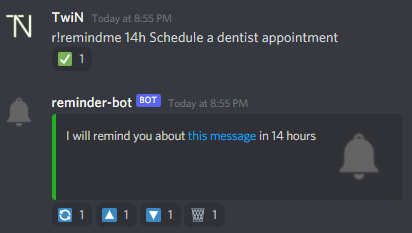
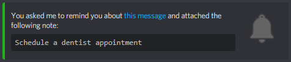

# discord-reminder-bot

[](https://cloud.docker.com/repository/docker/twinproduction/discord-reminder-bot)

This is a simple Discord bot for managing reminders.

If you react to a message with ⏰ (`:alarm_clock:`) or ⏲ (`:timer:`), a message will be sent to you through direct message informing you
that you will be reminded about the message you sent in 8 hours.

You may also use the following syntax:
```
!RemindMe <DURATION> [NOTE]
```
**Where:**
- `<DURATION>` must be use one of the following formats: `30m`, `6h30m`, `48h`
- `[NOTE]` is an optional note to attach to the reminder with less than 240 characters

Note that `!RemindMe` can be replaced by directly pinging the bot (e.g. `@reminder-bot 2h30m meeting about cookies`)

Once a reminder is created using one of the aforementioned methods, a direct message is sent to the user with several
options to manage the newly created reminder. This is internally referred to as the notification message:



Once a reminder is due, a direct message is sent to the user with a link to the message that triggered the creation
of the reminder.

Here is an example of a message with and without a note:



Furthermore, once a reminder has been deleted or has been processed, its notification message is automatically crossed
to make the differentiation between active and inactive reminders:


## Usage
| Environment variable | Description                           | Required | Default |
|:-------------------- |:------------------------------------- |:--- |:---- |
| DISCORD_BOT_TOKEN    | Discord bot token                     | yes | `""` |
| COMMAND_PREFIX       | Character prepending all bot commands | no  | `!`  |


## Getting started
### Discord
1. Create an application
2. Add a bot in your application
3. Save the bot's token and set it as the `DISCORD_BOT_TOKEN` environment variable
4. Go to `https://discordapp.com/oauth2/authorize?client_id=<YOUR_BOT_CLIENT_ID>&scope=bot&permissions=2112`
5. Add the bot to a server of your choice


## Docker
### Pulling from Docker Hub
```
docker pull twinproduction/discord-reminder-bot
```

### Building image locally
Building the Docker image is done as following:
```
docker build . -t twinproduction/discord-reminder-bot
```
You can then run the container with the following command:
```
docker run -e DISCORD_BOT_TOKEN=secret --name discord-reminder-bot twinproduction/discord-reminder-bot
```
